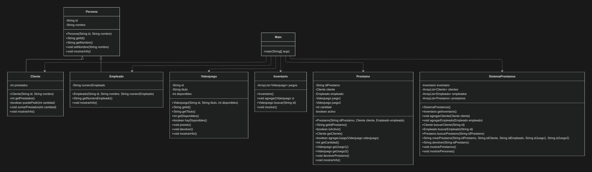

# Sistema de Préstamos de Videojuegos (Proyecto Final - POO Java)

Este proyecto es un sistema en consola hecho en **Java** para gestionar el **préstamo y devolución de videojuegos**, haciendo uso de un **inventario**, registro de **clientes** y **empleados**, y controlando las **reglas de negocio** como disponibilidad y límites de préstamos.

> Hecho con POO, menús con bucles, manejo de errores con `try/catch`, encapsulamiento, herencia, polimorfismo y abstracción.  

---

## Funcionalidades principales

- **Inicio de sesión** con usuario/contraseña definidos por el sistema.
- **Menú inicial**
  - Iniciar sesión
  - Ver información del programa
  - Salir
- **Inventario**
  - Agregar videojuegos
  - Ver inventario
- **Personas**
  - Registrar clientes
  - Registrar empleados
- **Préstamos**
  - Crear préstamo (máximo 2 juegos)
  - Devolver préstamo
  - Ver préstamos registrados

---

## Reglas del sistema (negocio)

1. Un **cliente** no puede tener **más de 2 videojuegos prestados** al mismo tiempo.
2. Un **préstamo** puede incluir **máximo 2 videojuegos**. 
3. No se puede prestar un videojuego si **no existe** en inventario. 
4. No se puede prestar un videojuego si **no tiene disponibilidad** (`disponibles <= 0`).
5. No se puede devolver un préstamo que no exista, o que ya haya sido devuelto
---

## Credenciales (login)

En el código se definieron credenciales fijas:

- Usuario: `Danielle`
- Contraseña: `flamewall`

---

## Estructura del proyecto

Clases incluidas:

- `Main`: punto de entrada, menús y flujo principal. 

- `Persona (abstracta)`: base para clientes y empleados. 

- `Cliente`: hereda de `Persona` y controla cuántos juegos tiene prestados (máximo 2).
- `Empleado`: hereda de `Persona` e incluye número de empleado. 

- `Videojuego`: representa un juego con id, título y disponibles. 

- `Inventario`: administra la lista de videojuegos (agregar, buscar, mostrar). 

- `Prestamo`: registra la operación de préstamo (cliente, empleado, hasta 2 juegos, activo/inactivo). 

- `SistemaPrestamos`: clase que centraliza inventario, personas y préstamos (crear/devolver/mostrar). 

---

## Funcionamiento del sistema

1. El programa inicia y muestra el **menú inicial**.

2. Si el usuario elige **iniciar sesión**, se validan credenciales.

3. Con login correcto, entra al **menú de servicios**.

4. El usuario puede:

   - Registrar videojuegos/clientes/empleados
   - Crear préstamos con reglas
   - Devolver préstamos activos
   - Consultar inventario y préstamos

5. El sistema mantiene consistencia:
   - baja disponibles al prestar
   - sube disponibles al devolver
   - suma/resta contador de prestados del cliente


---

## Los conceptos de POO aplicados

### Abstracción
- `Persona` es una clase **abstracta** con el método `mostrarInfo()` 

### Herencia
- `Cliente` y `Empleado` heredan de `Persona`. 

### Polimorfismo
- `mostrarInfo()` se implementa de forma distinta en `Cliente` y `Empleado` (override). 

### Encapsulamiento
- Atributos privados + getters/setters para controlar acceso (ej. `nombre`, `prestados`, `disponibles`).

### Manejo de errores (`try/catch`)
- Se usa en captura de entrada numérica y en alta de videojuego para evitar que el programa se rompa por entradas inválidas. 

---

## Diagrama UML 

> Este diagrama UML fue hecho en código `Mermaid` en Notion



---

## Clases y Main

`Persona.java`

```java
public abstract class Persona {
    private String id;
    private String nombre;

    public Persona(String id, String nombre) {
        this.id = id;
        this.nombre = nombre;
    }

    public String getId() { return id; }
    public String getNombre() { return nombre; }

    public void setNombre(String nombre) {
        if (nombre != null && !nombre.equals("")) {
            this.nombre = nombre;
        }
    }

    
    public abstract void mostrarInfo(); // un metodo abstracto para mostrar la informacion unicamente de los clientes y no de los empleados
}
```

---

`Empleado.java`

```java
public class Empleado extends Persona { // extends para hacer uso de herencia a empleados y clientes, porque ambas son personas
    private String numeroEmpleado;

    public Empleado(String id, String nombre, String numeroEmpleado) {
        super(id, nombre);
        this.numeroEmpleado = numeroEmpleado;
    }

    public String getNumeroEmpleado() { return numeroEmpleado; }

    @Override // un override para mostrar la informacion unicamente de los empleados, ya que la clase persona tiene su propio metodo para mostrar informacion, y aqui solo queremos que muestre informacion de los empleados
    public void mostrarInfo() {
        System.out.println("Empleado: " + getId() + " - " + getNombre() + " | NoEmpleado: " + numeroEmpleado);
    }
}
```
---

`Cliente.java`

```java
public class Cliente extends Persona {
    private int prestados; // cuántos juegos tiene prestados (máx 2)

    public Cliente(String id, String nombre) {
        super(id, nombre);
        prestados = 0;
    }

    public int getPrestados() { return prestados; }

    public boolean puedePedir(int cantidad) {
        return prestados + cantidad <= 2;
    }

    public void sumarPrestados(int cantidad) {
        prestados = prestados + cantidad;
        if (prestados < 0) prestados = 0;
    }

    @Override
    public void mostrarInfo() {
        System.out.println("Cliente: " + getId() + " - " + getNombre() + " | Prestados: " + prestados);
    }
}
```

---

`Videojuego.java`

```java
public class Videojuego {
    private String id;
    private String titulo;
    private int disponibles;

    public Videojuego(String id, String titulo, int disponibles) {
        this.id = id;
        this.titulo = titulo;
        this.disponibles = disponibles;
    }

    public String getId() { return id; }
    public String getTitulo() { return titulo; }
    public int getDisponibles() { return disponibles; }

    public boolean hayDisponibles() { // valida si hay disponibilidad de juegos
        return disponibles > 0;
    }

    public void prestar() {
        if (disponibles > 0) {
            disponibles--;
        }
    }

    public void devolver() { // para aumentar la cantidad disponible de juegos cuando se hacen devoluciones 
        disponibles++;
    }

    public void mostrarInfo() {
        System.out.println("Juego: " + id + " | " + titulo + " | Disponibles: " + disponibles);
    }
}
```

---

`Inventario.java`

```java
import java.util.ArrayList;

public class Inventario {
    private ArrayList<Videojuego> juegos; // otro arraylist para tener una lista de videojuegos en el inventario

    public Inventario() {
        juegos = new ArrayList<>();
    }

    public void agregar(Videojuego v) {
        juegos.add(v);
    }

    public Videojuego buscar(String id) {
        for (int i = 0; i < juegos.size(); i++) {
            if (juegos.get(i).getId().equals(id)) {
                return juegos.get(i);
            }
        }
        return null;
    }

    public void mostrar() {
        if (juegos.size() == 0) {
            System.out.println("Inventario vacío.");
            return;
        }
        for (int i = 0; i < juegos.size(); i++) {
            juegos.get(i).mostrarInfo();
        }
    }
}
```

---

`Prestamo.java`

```java

public class Prestamo {
    private String idPrestamo;
    private Cliente cliente;
    private Empleado empleado;

    private Videojuego juego1;
    private Videojuego juego2;
    private int cantidad;
    private boolean activo;

    // constructor 
    public Prestamo(String idPrestamo, Cliente cliente, Empleado empleado) {
        this.idPrestamo = idPrestamo;
        this.cliente = cliente;
        this.empleado = empleado;
        this.cantidad = 0;
        this.activo = true;
    }
    // getters y setters
    public String getIdPrestamo() { return idPrestamo; }
    public boolean isActivo() { return activo; }
    public Cliente getCliente() { return cliente; }

    public boolean agregarJuego(Videojuego videojuego) {
        if (cantidad == 0) {
            juego1 = videojuego;
            cantidad = 1;
            return true;
        } else if (cantidad == 1) {
            juego2 = videojuego;
            cantidad = 2;
            return true;
        }
        return false; 
    }

    public int getCantidad() { return cantidad; }

    public Videojuego getJuego1() { return juego1; }
    public Videojuego getJuego2() { return juego2; }

    public void devolverPrestamo() {
        activo = false;
    }

    public void mostrarInfo() { // mostrar información del prestamo
        System.out.println("Préstamo: " + idPrestamo + " | Activo: " + activo);
        System.out.println("Cliente: " + cliente.getNombre() + " | Empleado: " + empleado.getNombre());
        System.out.print("Juegos: ");
        // mostrar los juegos prestados
        if (juego1 != null) System.out.print(juego1.getTitulo()); // usamos != para negar si es igual a null y mostrar el juego
        if (juego2 != null) System.out.print(", " + juego2.getTitulo());

        System.out.println("-------------------------");
    }
}
```

---

`SistemaPrestamos.java`

```java
import java.util.ArrayList;

public class SistemaPrestamos {
    private Inventario inventario;
    private ArrayList<Cliente> clientes;
    private ArrayList<Empleado> empleados;
    private ArrayList<Prestamo> prestamos;
    private int contadorPrestamos;

    // arraylist para hacer listas de los clientes, empleados y prestamos, y un
    // inventario para manejar los videojuegos
    public SistemaPrestamos() {
        inventario = new Inventario();
        clientes = new ArrayList<>();
        empleados = new ArrayList<>();
        prestamos = new ArrayList<>();
        contadorPrestamos = 1; // empieza en 1
    }

    public Inventario getInventario() {
        return inventario;
    } // para mostrar el inventario desde main con el getter

    public void agregarCliente(Cliente cliente) {
        clientes.add(cliente);
    }

    public void agregarEmpleado(Empleado empleado) {
        empleados.add(empleado);
    }

    public Cliente buscarCliente(String id) { // busca al cliente por su id
        for (int i = 0; i < clientes.size(); i++) {
            if (clientes.get(i).getId().equals(id))
                return clientes.get(i);
        }
        return null;
    }

    public Empleado buscarEmpleado(String id) { // con esto buscamos a un empleado mediante su id
        for (int i = 0; i < empleados.size(); i++) {
            if (empleados.get(i).getId().equals(id))
                return empleados.get(i);
        }
        return null;
    }

    public Prestamo buscarPrestamo(String idPrestamo) { // busca prestamos por su id
        for (int i = 0; i < prestamos.size(); i++) {
            if (prestamos.get(i).getIdPrestamo().equals(idPrestamo))
                return prestamos.get(i);
        }
        return null;
    }

    public String crearPrestamo(String idCliente, String idEmpleado, String idJuego1, String idJuego2) {

        String idPrestamo = "P" + contadorPrestamos;
        contadorPrestamos++; // ID unico de un prestamo

        Cliente cliente = buscarCliente(idCliente);
        if (cliente == null)
            return "Cliente no encontrado."; // use un null porque si el sistema no encuentra una id con la que se dio
                                             // arrojara un mensaje de error

        Empleado empleado = buscarEmpleado(idEmpleado);
        if (empleado == null)
            return "Empleado no encontrado.";

        int cantidad = 0;
        if (idJuego1 != null && !idJuego1.equals(""))
            cantidad++;
        if (idJuego2 != null && !idJuego2.equals(""))
            cantidad++;

        // reglas que establecí desde la documentación: máximo 2 juegos por persona y no
        // puede tener mas de 2 prestados al mismo tiempo
        if (cantidad == 0)
            return "Debes elegir al menos 1 juego.";
        if (cantidad > 2)
            return "Máximo 2 juegos.";

        if (!cliente.puedePedir(cantidad))
            return "El cliente ya tiene 2 juegos prestados."; // ! este operador lo use para negar la condicion que es
                                                              // si el cliente puede pedir el prestamo

        Videojuego juego1 = inventario.buscar(idJuego1);
        if (juego1 == null)
            return "Juego 1 no existe.";
        if (!juego1.hayDisponibles())
            return "Juego 1 sin disponibilidad.";

        Videojuego j2 = null; // este es por si el cliente quiere pedir otro juego, con un null por si no
                              // quiere pedirlo
        if (cantidad == 2) {
            j2 = inventario.buscar(idJuego2);
            if (j2 == null)
                return "Juego 2 no existe.";
            if (!j2.hayDisponibles())
                return "Juego 2 sin disponibilidad.";
        }

        juego1.prestar();
        if (j2 != null)
            j2.prestar();

        Prestamo p = new Prestamo(idPrestamo, cliente, empleado); // con esto se crea un prestamo con id, cliente y
                                                                  // empleadp
        p.agregarJuego(juego1);
        if (j2 != null)
            p.agregarJuego(j2);

        prestamos.add(p);

        cliente.sumarPrestados(cantidad);

        return "Préstamo creado.";
    }

    public String devolver(String idPrestamo) { // este metodo lo hice para devolver un prestamo mediante su id
        Prestamo p = buscarPrestamo(idPrestamo);
        if (p == null)
            return "Préstamo no encontrado.";
        if (!p.isActivo())
            return "Ese préstamo ya fue devuelto.";

        if (p.getJuego1() != null)
            p.getJuego1().devolver();
        if (p.getJuego2() != null)
            p.getJuego2().devolver();

        p.getCliente().sumarPrestados(-p.getCantidad());

        p.devolverPrestamo();
        return "Devolución lista.";
    }

    public void mostrarPrestamos() { // tipo void porque no devuelve nada, solo muestra la información de los
                                     // prestamos
        if (prestamos.size() == 0) {
            System.out.println("No hay préstamos.");
            return;
        }

        for (int i = 0; i < prestamos.size(); i++) {
            prestamos.get(i).mostrarInfo();
        }
    }

    public void mostrarPersonas() { // para mostrar informacion de clientes y empleados, otro void porque no
                                    // devuelve nada
        for (int i = 0; i < clientes.size(); i++)
            clientes.get(i).mostrarInfo();
        for (int i = 0; i < empleados.size(); i++)
            empleados.get(i).mostrarInfo();
    }
}
```

---

`Main.java`

```java
import java.util.Scanner;

public class Main {

    private static final String usuario1 = "Danielle";
    private static final String contraseñaU1 = "flamewall";

    public static void main(String[] args) {

        Scanner scanner = new Scanner(System.in);

        
        SistemaPrestamos sistema = new SistemaPrestamos();

        
        sistema.getInventario().agregar(new Videojuego("71276", "Doom Eternal", 2));
        sistema.getInventario().agregar(new Videojuego("81273", "Resident Evil 4 Remake", 1)); // Juegos determinados en el sistema
        sistema.getInventario().agregar(new Videojuego("27365", "Mario Kart", 3));
        sistema.agregarCliente(new Cliente("62512", "Sofia"));
        sistema.agregarCliente(new Cliente("72365", "Ana"));
        sistema.agregarEmpleado(new Empleado("712636", "Daniel", "54678"));
        sistema.agregarEmpleado(new Empleado("923873", "Angel", "28137"));

        int opcionInicio = 0;

        do { // menu con do while para que se repita hasta que el usuario elija salir
            System.out.println("===== MENÚ INICIAL =====");
            System.out.println("1. Iniciar sesión");
            System.out.println("2. Ver información del programa");
            System.out.println("3. Salir");
            System.out.print("Elige una opción: ");

            opcionInicio = leerEnt(scanner);

            switch (opcionInicio) { // un switch para manejar las opciones del menú inicial
                case 1:
                    boolean loginOk = iniciarSesion(scanner);
                    if (loginOk) {
                        menuServicios(scanner, sistema); 
                    }
                    break;

                case 2:
                    mostrarInformacion(scanner);
                    break;

                case 3:
                    System.out.println("Gracias por usar el programa. Saliendo...");
                    break;

                default:
                    System.out.println("Opción inválida.");
            }

        } while (opcionInicio != 3); // hasta que el usuario elija opcion 3 se acaba el programa

        scanner.close();
    }

    private static boolean iniciarSesion(Scanner scanner2) { // utilizamos un método para iniciar sesión, boolean para saber si el login es correcto o no, private para que solo se use dentro de esta clase, static para no tener que crear un objeto de la clase Main para usarlo
        System.out.println("--- INICIAR SESIÓN ---");
        System.out.print("Usuario: ");
        String usuario = scanner2.nextLine();

        System.out.print("Contraseña: ");
        String contraseña = scanner2.nextLine();

        if (usuario.equals(usuario1) && contraseña.equals(contraseñaU1)) { // operador logico && para verificar que el usuario y la contraseña sean correctos
            System.out.println("Bienvenido de nuevo.");
            return true;
        } else { // uso un if else para manejar si es correcto o no el login
            System.out.println("Usuario o contraseña incorrectos, vuelve a intenarlo.");
            return false;
        }
    }

    private static void mostrarInformacion(Scanner scanner3) { // método para mostrar información del programa, se usa void porque no devuelve nada
        System.out.println("--- INFORMACIÓN DEL PROGRAMA ---");
        System.out.println("Gracias por usar este programa.");
        System.out.println("Hecho con 2 horas de sueño, 2 tazas de café y un Monster para aguantar el sueño.");
        System.out.println("Creado por mi, Daniel, estudiante de 1er semestre en IDS.");
        System.out.println("Con ayuda adicional de mi hermano desarrollador, quien me ayudó a entender mejor los bucles y try catch y usarlos de manera correcta.");
        System.out.println("Este sistema permite gestionar préstamos de videojuegos, agregar empleados, clientes y los videojuegos mismos.");
        System.out.println("En este programa hicimos uso de conceptos fundamentales de la programación orientada a objetos como clases, objetos, herencia, encapsulamiento, polimorfismo y abstracción.");
        System.out.println("Definimos reglas dentro de este sistema: ");
        System.out.println(" - Un cliente no puede tener más de 2 videojuegos prestados al mismo tiempo.");
        System.out.println(" - Un ṕréstamo puede tener un máximo de 2 videojuegos.");
        System.out.println(" - No se puede prestar un videojuego que no esté disponible en el inventario.");
        System.out.println(" - No se puede devolver un préstamo que no exista o que ya haya sido devuelto.");
        System.out.println("El usuario y contraseña para iniciar sesión son Danielle y flamewall respectivamente.");
        System.out.println("Presiona ENTER para volver al menú");
        scanner3.nextLine();
    }

    private static void menuServicios(Scanner scanner4, SistemaPrestamos sistema) { // otro método para mostrar el menú de servicios, se llama después de iniciar sesión correctamente

        int opcion = 0; // usamos esta variable para almacenar la opcion del usuario

        do {
            System.out.println("===== MENÚ DE SERVICIOS =====");
            System.out.println("1. Agregar videojuego al inventario");
            System.out.println("2. Ver inventario");
            System.out.println("3. Registrar cliente");
            System.out.println("4. Registrar empleado");
            System.out.println("5. Crear préstamo");
            System.out.println("6. Devolver préstamo");
            System.out.println("7. Ver préstamos");
            System.out.println("8. Ver Clientes y Empleados");
            System.out.println("9. Cerrar sesión");
            System.out.print("Elige una opción: ");

            opcion = leerEnt(scanner4);

            switch (opcion) {
                case 1:
                    agregarVideojuego(scanner4, sistema); // llamamos al metodo de registrar videojuego
                    break;

                case 2:
                    System.out.println("--- INVENTARIO ---");
                    sistema.getInventario().mostrar(); // mostramos el inventario llamando al método mostrar del inventario
                    break;

                case 3:
                    registrarCliente(scanner4, sistema); // llamamos al metodo de registrar cliente
                    break;

                case 4:
                    registrarEmpleado(scanner4, sistema); // llamamos al metodo para registrar empleado
                    break;

                case 5:
                    crearPrestamo(scanner4, sistema); // llamamos al metodo para crear un prestamo
                    break;

                case 6:
                    devolverPrestamo(scanner4, sistema); // llamamos al metodo para devolver un prestamo
                    break;

                case 7:
                    System.out.println("--- PRÉSTAMOS ---");
                    sistema.mostrarPrestamos(); 
                    break;

                
                case 8:
                    listarPersonas(sistema); // llamamos al metodo para listar clientes y empleados
                    break;

                case 9:
                    System.out.println("Cerrando sesión...");
                    break;

                default:
                    System.out.println("Opción inválida.");
            }

        } while (opcion != 9);
    }

    private static void agregarVideojuego(Scanner scanner5, SistemaPrestamos sistema) {
        try { // try catch para manejar errorres cuando se agrega un videojuego, por ejemplo si el usuario ingresa un numero en vez de un texto
            System.out.println("--- AGREGAR VIDEOJUEGO ---");
            System.out.print("ID: ");
            String idJuego = scanner5.nextLine();

            System.out.print("Título: ");
            String titulo = scanner5.nextLine();

            System.out.print("Disponibles: ");
            int disponibilidad = leerEnt(scanner5);

            sistema.getInventario().agregar(new Videojuego(idJuego, titulo, disponibilidad));
            System.out.println("Videojuego agregado.");
        } catch (Exception ex) { // maneja el error y muestra un mensaje al usuario
            System.out.println("Error al agregar videojuego.");
        }
    }

    // a partir de aqui son metodos para hacer registros de clientes, empleados, hacer prestamos y devoluciones, parecidos a los anteriores 
    private static void registrarCliente(Scanner scanner6, SistemaPrestamos sistema) {
        System.out.println("--- REGISTRAR CLIENTE ---");
        System.out.print("ID: ");
        String idCliente = scanner6.nextLine();

        System.out.print("Nombre: ");
        String nombre = scanner6.nextLine();

        sistema.agregarCliente(new Cliente(idCliente, nombre));
        System.out.println("Cliente registrado correctamente.");
    }

    private static void registrarEmpleado(Scanner scanner7, SistemaPrestamos sistema) {
        System.out.println("--- REGISTRAR EMPLEADO ---");
        System.out.print("ID: ");
        String idEmpleado = scanner7.nextLine();

        System.out.print("Nombre: ");
        String nombre = scanner7.nextLine();

        System.out.print("Número de empleado: ");
        String num = scanner7.nextLine();

        sistema.agregarEmpleado(new Empleado(idEmpleado, nombre, num));
        System.out.println("Empleado registrado correctamente.");
    }

    private static void crearPrestamo(Scanner scanner8, SistemaPrestamos sistema) {
        System.out.println("--- HACER UN PRÉSTAMO (máximo 2 juegos) ---");
        
        System.out.print("ID Cliente: ");
        String idCliente = scanner8.nextLine();

        System.out.print("ID Empleado: ");
        String idEmpleado = scanner8.nextLine();

        System.out.print("ID Juego 1: ");
        String idJuego1 = scanner8.nextLine();

        System.out.print("ID Juego 2 (opcional)");
        String idJuego2 = scanner8.nextLine();

        String prestamo = sistema.crearPrestamo(idCliente, idEmpleado, idJuego1, idJuego2);
        System.out.println(prestamo);
    }

    private static void devolverPrestamo(Scanner scanner9, SistemaPrestamos sistema) {
        System.out.println("--- DEVOLVER PRÉSTAMO ---");
        System.out.print("ID Préstamo: ");
        String idPrestamo = scanner9.nextLine();

        String prestamoDevuelto = sistema.devolver(idPrestamo);
        System.out.println(prestamoDevuelto);
    }

    private static void listarPersonas(SistemaPrestamos sistema) {
    System.out.println("--- CLIENTES Y EMPLEADOS REGISTRADOS ---");
    sistema.mostrarPersonas();
}   


    private static int leerEnt(Scanner scanner10) {
        int numero = 0;
        boolean valido = false;

        while (!valido) {
            try {
                String texto = scanner10.nextLine();
                numero = Integer.parseInt(texto);
                valido = true;
            } catch (Exception e) {
                System.out.print("Entrada inválida, intenta de nuevo: ");
            }
        }
        return numero;
    }
}
```