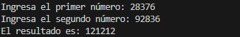
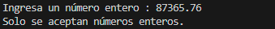
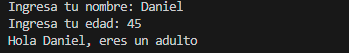
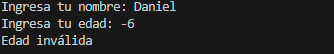
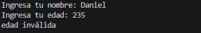
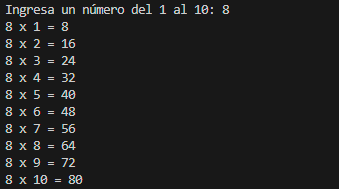
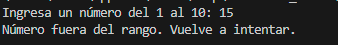

# Ejercicios semana 4

Dentro de esta rama se documentan los ejercicios de la semana 4, tomando como referencia los apuntes tomados en clase y la guia **Temas** de Java proporcionada en los anuncios de plataforma.

---

## Ejercicio 1: Suma simple con validación de entrada (fácil)

Escribe un programa que pida al usuario dos números enteros, valide que realmente
sean enteros usando manejo de errores, y luego muestre la suma de ambos.

#### Código usado en Java

```Java
import java.util.Scanner;
public class ejercicios {
    public static void main(String[] args) {
        Scanner scanner = new Scanner(System.in);
        int num1, num2;
        System.out.print("Ingresa un número entero : ");
        if (scanner.hasNextInt()) {
            num1 = scanner.nextInt();
        } else {                                    
            System.out.println("Solo se aceptan números enteros.");
            scanner.close();
            return;
        }
        System.out.print("Ingresa otro número entero: ");
        if (scanner.hasNextInt()) {
            num2 = scanner.nextInt();
        } else {
            System.out.println("Solo se aceptan números enteros.");
            scanner.close();
            return;
        }
        int sumaNum = num1 + num2;
        System.out.println("El resultado es: " + sumaNum);
        scanner.close();
    }
}
```
>Primera captura muestra resultado de la suma


>Segunda captura muestra error si se introduce un número que no sea entero


---

## Clasificación de edad con mensaje personalizado (fácil)

Pide el nombre y la edad del usuario.
Usa condicionales para mostrar:
- Menos de 13: "Hola <nombre>, eres un niño."
- 13 a 17: "Hola <nombre>, eres un adolescente."
- 18 a 64: "Hola <nombre>, eres un adulto."
- 65 o más: "Hola <nombre>, eres un adulto mayor."

#### Código usado en Java

```Java
import java.util.Scanner;
public class ejercicios {
    public static void main(String[] args) {
        Scanner scanner = new Scanner(System.in);
        System.out.print("Ingresa tu nombre: ");
        String nombre1 = scanner.nextLine();
        System.out.print("Ingresa tu edad: ");
        int edad1 = scanner.nextInt();
        
        if (edad1 < 0) {
            System.out.println("Edad inválida"); //  edad negativa es inválida
        } else if (edad1 < 13) {
            System.out.println("Hola " + nombre1 + ", eres un niño");
        } else if (edad1 <= 17) {
            System.out.println("Hola " + nombre1 + ", eres un adolescente");
        } else if (edad1 <= 64) {
            System.out.println("Hola " + nombre1 + ", eres un adulto");
        } else if (edad1 > 120) {
            System.out.println("edad inválida"); // edad mayor a 120 es inválida
        }
        else {
            System.out.println("Hola " + nombre1 + ", eres un adulto mayor"); // si es 65 o más
        }
        scanner.close();
    }
}
```

>Primera captura determina que el usuario es adulto


>Segunda captura muestra error sí la edad es negativa


>Segunda captura muestra error sí la edad excede al límite establecido


---

## Ejercicio 3: Tabla de multiplicar con `for` (fácil)

Pide un número entero entre 1 y 10.
Muestra su tabla de multiplicar del 1 al 10 usando un ciclo `for`.
Si el usuario ingresa algo no entero, usa manejo de errores para pedir el dato de
nuevo.

#### Código usado en Java

```Java
import java.util.Scanner;
public class ejercicios {
    public static void main(String[] args) {
        Scanner scanner = new Scanner(System.in);
        System.out.print("Ingresa un número del 1 al 10: ");
        int numero1 = scanner.nextInt();

        if (numero1 < 1 || numero1 > 10) {
            System.out.println("Número fuera del rango. Vuelve a intentar.");
        } else {
            for (int i = 1; i <= 10; i++) {
                System.out.println(numero1 + " x " + i + " = " + (numero1 * i));
            }
        }
        scanner.close();
    }
}
```

>Primera captura muestra la tabla del número ingresado


>Segunda captura muestra error si no es un número entre 1 y 10


---

## Ejercicio 4: Arreglo de calificaciones y promedio (fácil–medio)